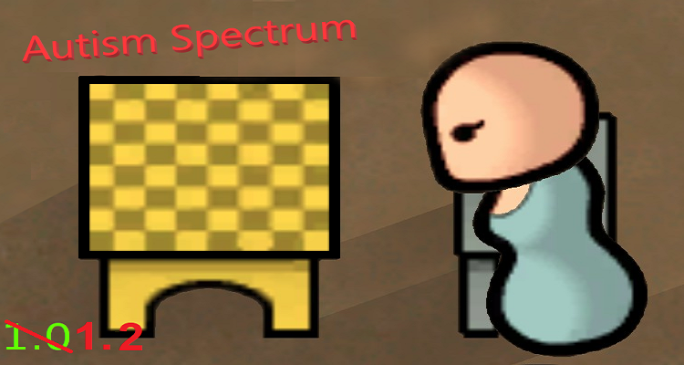

# <b>rimworld-asperger's</b>

The Rimworld aneurotypical mod

<b>Description</b>

Adds Autism to the Rim. It is an uncommon spectrum of traits which alters colonists stats.
Ever wondered why your pawn always plays chess by themselves? Why they constantly repeat the same activities? Maybe they have Autism.

This mod adds the trait "Autism" with stats:

    -socialFightChanceFactor muliplied by 2
    -PsychicSensitivity Reduced by 100%
    -MentalBreakThreshold increased by 0.08
    -PainShockThreshold decreased by 0.08
    -RestRateMultiplier multiplied by 0.80
    -Intellectual skill increased by 2
    -Social skill decreased by 4

    OR

    -PsychicSensitivity Reduced by 100%
    -Artistic skill increased by 6
    -Social skill decreased by 5

    OR

    -PsychicSensitivity Reduced by 100%
    -Artistic skill increased by 2
    -Intellectual skill increased by 2

    OR

    -PsychicSensitivity Reduced by 100%
    -Crafting skill increased by 4
    -Social skill decreased by 7

This mod is save game compatible, but I don't recommend removing it mid game unless you want to edit your saves manually.

This mod is a work in progress and I may add new features.

<b>Notice</b>

I aim not to glorify Autism or to denounce it, but to implement it into a video game which must be balanced. I make generalisations with the symptoms of being aneurotypical to make the game experience flow more easily. If you have a issue with anything in this mod, just report an issue and I'll work on it.

=>(P-90-For-Retail)&lt;=

