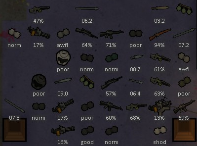
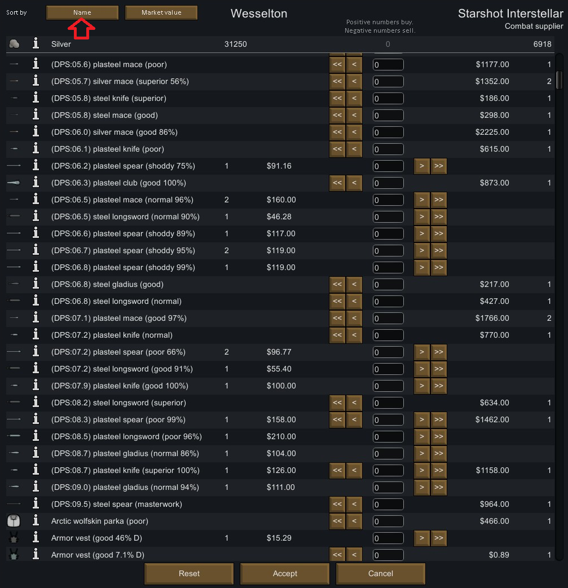
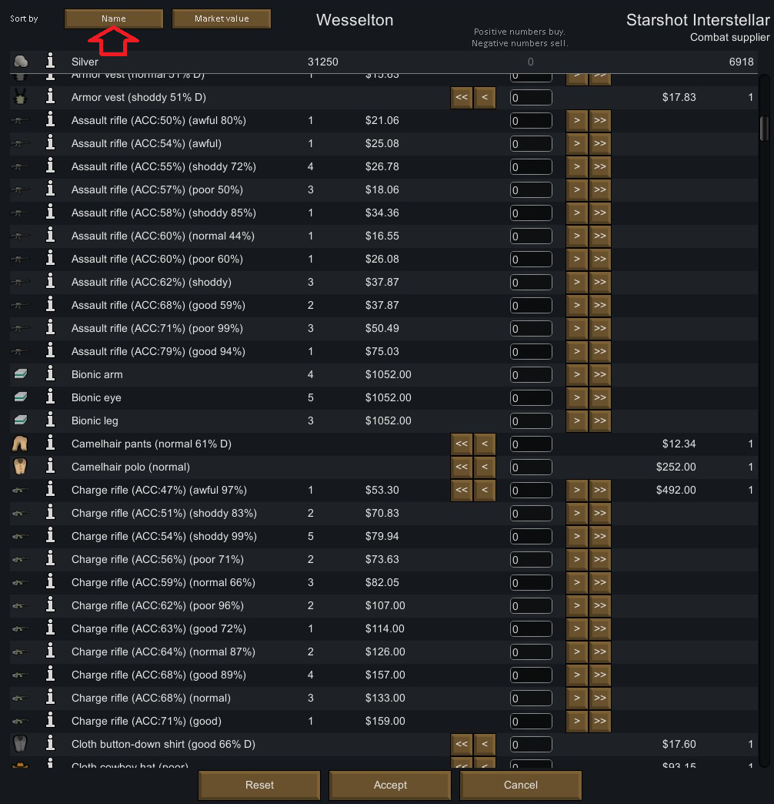

# AccuraSight

This is a mod for the game RimWorld by Ludeon Studios.

Updates the labels on weapons to show Accuracy% for ranged weapons and DPS for melee weapons.

Enhances sorting options in Merchant windows, and in mods like Moody and Numbers.

 

# Table of Contents

* [Introduction and Explanation](#introduction-and-explanation)
* [Specific Additional Features](#specific-additional-features)
* [How to Install](#how-to-install)
* [How to Update](#how-to-update)
* [Bugs, New Features, and Updates](#bugs-new-features-and-updates)
* [Credits](#credits)

# Introduction and Explanation

You'll add the mod. You'll enable the mod. It just works. If you don't like it, disable the mod.

When enabled, the visible labels on weapons will be replaced or updated.

In the main window, when looking at a weapon on the ground, ranged weapons will instead list their Accuracy%, and melee weapons will list their DPS.

We also insert the Accuracy% or DPS into the full text label, visible anywhere, such as the infobox.

 

It also means it renders directly onto a pawn's infobox when selected.

 

This also means, when you sort a Merchant window by Name, all of your melee weapons are sorted by straight DPS.

and all of your ranged weapons are grouped by type, and then sorted by Accuracy%.

This effect also propagates immediately into mods like Moody or Numbers, with the same result.

Moody will now sort your melee pawns by straight weapon DPS.

 

and Moody will now sort your ranged weapon pawns by type, then by weapon Accuracy%.

 

and Numbers will also behave the same way, and will sort melee pawns by straight weapon DPS.

 

and will sort ranged weapon pawns by type, then by weapon Accuracy%.

 

# Specific Additional Features

None, as of yet.

# How to Install

At the top of this page, on the right-hand-side, a little ways down, will be a green button, labeled "Clone or download". Click it, then click "Download ZIP". Your browser will download it.

Unzip it, and it will spew out a single folder, which is probably named something like `AccuraSight-master`.

Assuming you are working with default installation directories on a Windows system, you will want to move this entire folder into:

`C:\Program Files (x86)\Steam\steamapps\common\RimWorld\Mods`

If you did it correctly, the result should be a directory structure that looks something like this:

`C:\Program Files (x86)\Steam\steamapps\common\RimWorld\Mods\AccuraSight-master\Assemblies`

Then restart RimWorld and enable it like any other mod.

# How to Update

First and foremost, please note that I never test updating mods on older saved games. You can try it, but please assume that a new game might always be necessary.

I also don't explicitly test whether the mod can be disabled on an existing game. Please also assume that a new game might always be necessary.

With that out of the way:

Updating is just deleting the previous version of the mod and then installing a new version.

So again, assuming default installation directories on a Windows system, you'll want to delete the same folder that you added during installation, which probably looks something like:

`C:\Program Files (x86)\Steam\steamapps\common\RimWorld\Mods\AccuraSight-master`

Then follow the previous instructions to download and install the new version, by repeating the same steps as installing the original version.

# Bugs, New Features, and Updates

You are currently looking at a GitHub repository for managing application code. I work out of this GitHub repository, and so to talk about bugs, new features, or updates, you need to know a little bit about navigating a GitHub repository like this one.

Beneath the aforementioned green button "Clone or download", it will say "Latest commit", followed by a couple random characters, followed by an amount of time. This stamp indicates how long ago the mod was last updated.

So if you think you found a problem, check this stamp. Perhaps the mod has already been updated since you downloaded it last, and you should download a new version and update. See the above instructions for how to update.

By default, you are probably looking at the "master" branch. You can see this at the top of the page, on the left-hand-side, a little ways down, it will say "Branch: something", probably "Branch: master", with a little down arrow.

The "master" branch contains the current version of the mod which I consider to be tested and stable. Mostly. I guess.

Most (but not all) of my mods have a "beta" branch for pre-release, which might offer new features or bug fixes that should probably work, theoretically, but I haven't really done much testing on, so I'm not quite sure.

So if you tried updating from the "master" branch, and you still think you found a bug or a problem, or if you just want to try the shiny new features before everybody else, consider downloading the "beta" branch and installing that instead.

To do this, just click the button where it says "Branch: master", and then click the option for "beta". Congratulations! You've changed branches! Follow the same steps to download and install, except instead of `AccuraSight-master` it will now be `AccuraSight-beta`. You can have both versions installed, but please don't try to have both versions enabled at once using the in-game Mod menu.

You will probably see other choices besides "master" and "beta", but I don't recommend clicking them. I am probably in the middle of working on them, and they are probably only halfway done, and broken, otherwise they'd already be part of "beta".

So if you tried updating the master branch, and you tried the beta branch, and you still thing you found a bug, or a problem, or want to suggest a new feature, wander over to the "Issues" tab. You can find this at the very top of the page, you are currently on the first tab "Code", you want to change to the second tab "Issues".

You can look here to see if your bug, issue, or suggestion is already present, and add comments if you wish.

If it's not there, look to the right-hand-side, click the green button "New issue", just type a Title, and Leave a comment, and then look below and click the green button "Submit new issue". I will get back to you. Maybe. Eventually. Meanwhile, other users might be able to chime in and help you too!

# Credits

I'd just joined the [RimWorld Discord](https://discord.gg/UTaMDWc) and they have been an incredibly supportive bunch!

I posted the idea to the mod-ideas channel, and @lost_RD and @spdskatr immediately chimed in with the key concept that accomplished most of the work.

From there out, it was just cleanup and polish! We went from concept to working prototype in under 24 hours!

This was also my first foray into using Harmony, and so another shoutout to @Brrainz for making that possible!
