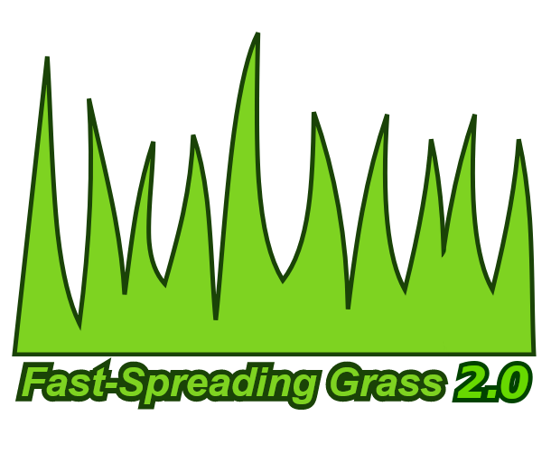

# FastSpreadingGrass

Makes grass able to spread seeds quicker. They now can emit seeds after 1 day instead of 3 days normally.

In the end, it makes grass regrowing quicker after fires or winter; *you know for those time where the whole map seems deprived of any grass ...*

## Release 
 
- [Download](https://github.com/kaptain-kavern/FastSpreadingGrass/releases/latest) 
- [Steam Workshop](http://steamcommunity.com/sharedfiles/filedetails/?id=1228372243) 

## Thanks
- Picture is from [game-icons.net](http://game-icons.net/) and is licensed under [CC BY 3.0](https://creativecommons.org/licenses/by/3.0/).
