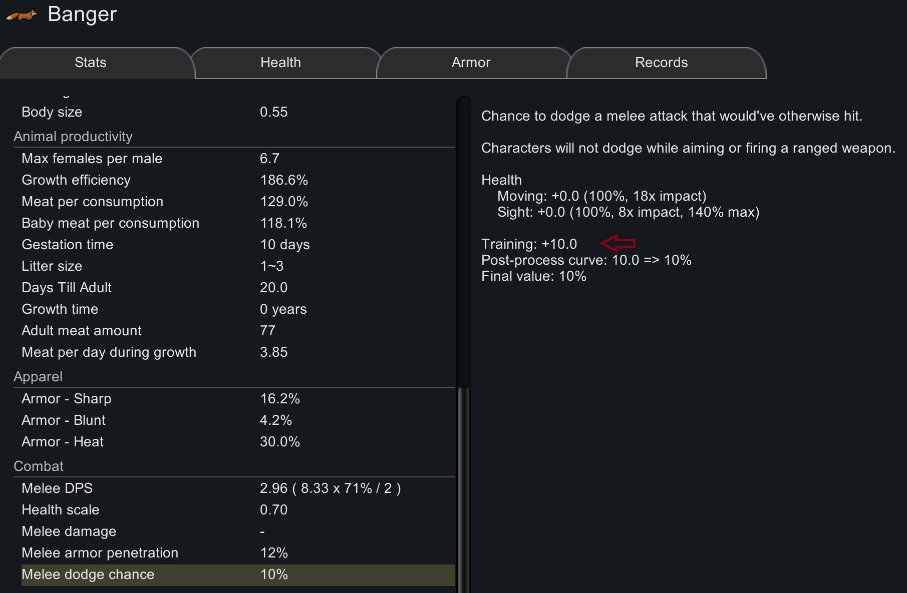

# Animal Melee Enhance for RimWorld

A little mod that adds melee hit chance and melee dodge chance to animals that are well trained. Need to restart the game for the new settings to take effect.

I would expect it to be compatible with most mods. New animals from other mods should also benefit from this change.

