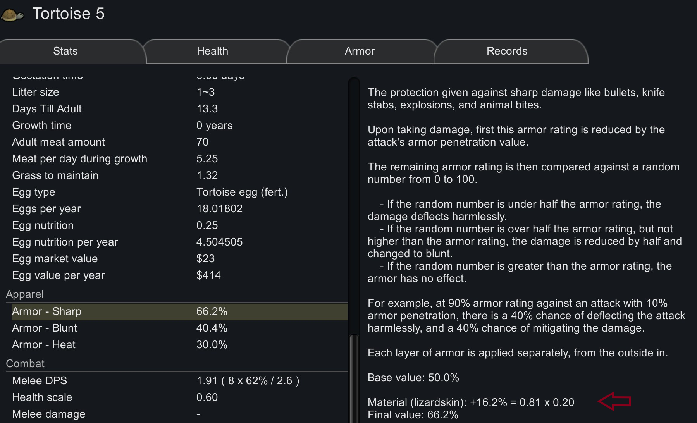

# Leather Skin As Armor for RimWorld

A little mod that adds some armor ratings to animals, based on their leather type.

I would expect it to be compatible with most mods. New animals from other mods should also benefit from this change.

