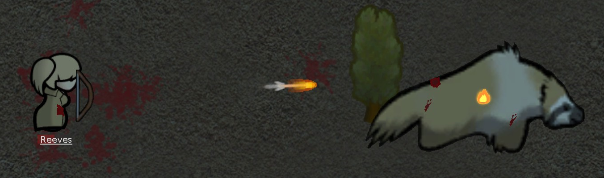
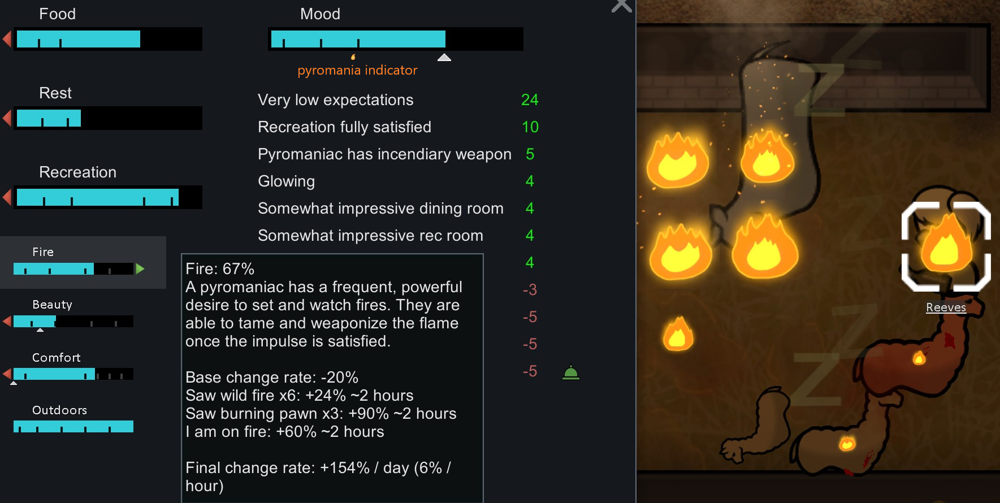
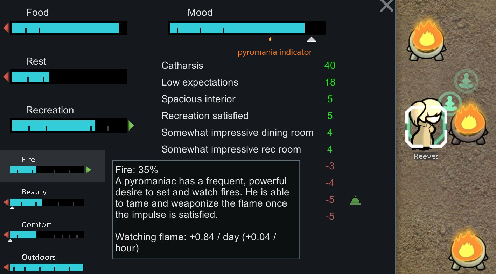

# Pyromaniac Is Fun for RimWorld

Do you dislike pyromaniacs? Now think again! This mod hopefully makes pyromaniac fun to play with. They have unique mechanisms and might prove worthy in certain situations.

It is still in beta. Feedback is welcome. Please leave a comment if you spot any issues or have any suggestions! Hope you like it.

## Traits Should be Fun

- Motivation: Traits should be more than value adjustments, not simply positive or negative. Ideally, each trait would deliver some unique mechanisms which enable a variety of play styles.
- This mod focuses on Pyromaniac. It is part of an ongoing development of "Traits Are Fun" mod series.
- It works best when Royalty DLC is installed.

## Features

- It adds a Fire need bar for pyromaniac (Royalty DLC required).
    - Mood offsets based on the bar length.
    - The bar drops gradually.
    - The bar increases when
        - meditating on flames (Hence require Royalty), at a speed proportional to the focus strength.
        - observing wild fires or burning pawns for a brief duration, at a speed proportional to the number of observations.
        - self on fire
- It adds a pyromania threshold indicator below the mood bar.
    - Lower (more left) is better.
    - A pyromaniac no longer triggers "fire starting spree" if his mood is above the pyromania threshold.
    - Longer fire need bar results in lower pyromania threshold. So keep your pyromaniacs satisfied with fire need.
- Pyromaniacs have a chance to shoot fire arrows if they carry bows.
    - Fire arrows deal an extra 10 flame damage (hence may ignite the target pawn) in additional to the original damage.
    - The fire need bar drops with each fire arrow shot.
- Pyromaniacs have a chance to ignite their target pawn if attack in melee.
    - Igniting melee attack deals 10 flame damage.
    - The fire need bar drops with each igniting melee attack.
- Pyromaniacs no longer have forced miss radius when carrying certain ranged incendiary weapons e.g. incendiary launcher.
    - This allows pyromaniacs with high shooting skill to set fire more accurately.
- Pyromaniacs no longer receive mood bonus when carrying certain ranged incendiary weapons.
    - E.g. Incendiary launcher => mood bonus
    - E.g. Smoke launcher => no mood bonus
    - Technically, it checks the projectile damage type.
- Be cautious! Enemy pyromaniacs can shoot fire arrows & ignite in melee attack too. Tribes can be devastating.
- The choice is yours. Most configurations can be easily toggled or modified in game settings, or in XML.
    - E.g. You can increase the fire attack chance to 100%, or decrease the fire bar consumption to 0.
    - Don't simply create my default. Create your own play style!

## Credits

- This mod is heavily inspired from Aelanna's excellent Better Pyromania. Please have a check if Better Pyromania suits your taste better.

## Translation

- 日本語 - Djur

---

# 有趣的纵火狂

你讨厌纵火狂么？这个模组改变了纵火狂的机制，使其玩起来更有意思，在某些场合下或有奇效。

## 特性应该更有趣

- 动机：特性应该不仅仅是数值大小的调节。它们不该有正面负面之分。在理想状况下，每个特性会带来某些独有的机制，可以延伸出更多的玩法。
- 这是一个关于纵火狂的模组，属于“有趣的特性”模组系列（其它特性正在陆续开发中）
- 某些机制需要皇权DLC

## 特点

- 纵火狂增加了一个火焰需求（需要皇权DLC）
    - 火焰条长短影响心情
    - 火焰条会逐渐下降
    - 对于火焰冥想可以增加火焰条，速度和媒介的冥想增效正相关
    - 小人看到火焰或者燃烧的生物可以增加火焰条（持续一小段时间），速度和火焰数量正相关
    - 小人自己着火也会增加火焰条
- 纵火狂心情条下方增加了一个纵火标识
    - 纵火标志越左边越好
    - 如果心情大于纵火标识的位置，小人将不会触发心灵奔溃之乱纵火
    - 火焰条越长，纵火标志越靠左
- 纵火狂如果持有弓箭的话就有几率发射火箭
    - 火箭在原箭头效果下额外增加10点火焰伤害，并可以点燃目标生物。
    - 发射火箭会降低火焰条
- 纵火狂近战可以点燃对手
    - 这一招式造成10点火焰伤害
    - 这一招式会降低降低火焰条
- 纵火狂可以免除某些燃烧武器的"forced miss radius"
    - 比如燃烧弹发射器，它的命中可以像普通枪械一样计算
    - 因此高射击的纵火狂使用这些武器时可以更好的命中
- 纵火狂持有某些燃烧武器时不再加心情
    - 比如燃烧弹发射器 => 加心情
    - 比如烟雾弹发射器 => 不加心情 这明显就不应该算做燃烧武器）
- 敌对的纵火狂也会发射火箭和近战放火！利好部落敌人
- 几乎所有的数值都可以在游戏中或者XML修改。
    - 比如你可以设置成攻击必然带火，或者使它们不再消耗火焰条。
    - 正义或真实，选择权在你！

## 感谢与求助

- 感谢贴吧众网友提供想法和建议。
- 欢迎大家测试。如果你有其它好点子也欢迎留言分享，我会努力改进并且实现你的想法。
- 希望能够让你获得更有趣的游戏体验。
- 跪求更好的创意工坊封面图片。我不会画画，且缺乏艺术细胞。
- 跪求模组简介，以及游戏中文本的中英文润色。我同样缺乏文艺细胞。

