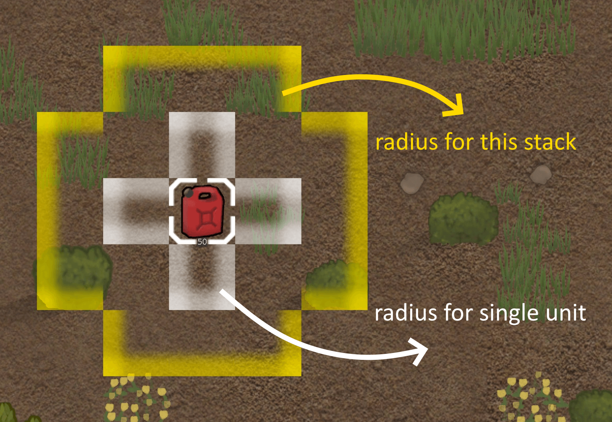
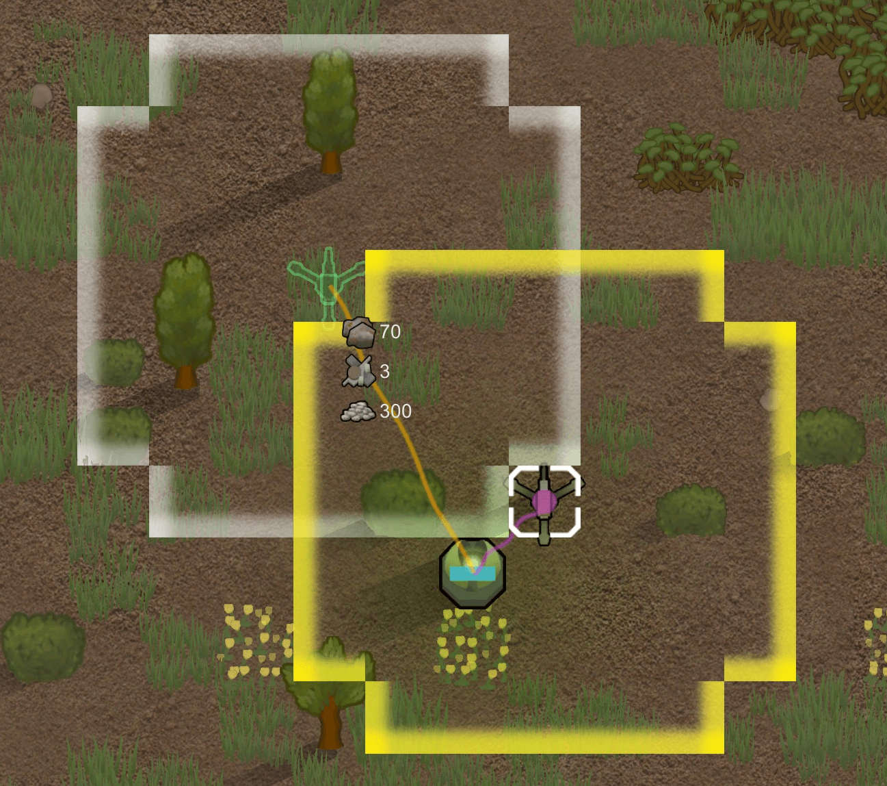

# Explosive Radius for RimWorld

This is a little QoL mod that displays explosion radius on all explosives on selection and placing.

Feedback is welcome. Please leave a comment if you spot any issues or have any suggestions! Hope you like it.

