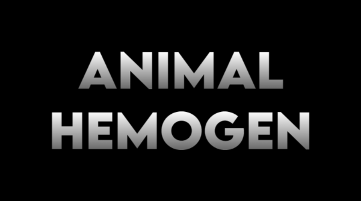

# 

Harvest hemogen from your poor unfortunate animals!

**Commissioned in the RimWorld Mod Market**

## Features

- Use animals as an alternative source of hemogen packs
- Animal hemogen is less effective than human hemogen
- Added support for bloodfeeding directly from animals
- Extra bloodfeeder precept for Ideology DLC (if present)
- Support for Hemogen Extractor and TastyHemo (if present)
- Animal variant for Buildable Blood Torches (if present)

## Future Plans

- Add traits for pawn-specific bloodfeeding preferences
- Hazy plans on more expansive hemogen system

## Recommended Mods

- Buildable Blood Torches - Make your own blood torches
- Hemofungus - Produce hemogen from fungus
- Hemogen Extractor - Improved hemogen production
- TastyHemo - Eat hemogen packs for food

## Existing Saves

This mod should be safe to add or remove from saves!

## Bugs and Requests

Let me know if there are any bugs or requests, I'll happily do my best to fix them up!

MIT License | Open to contributions and suggestions!
