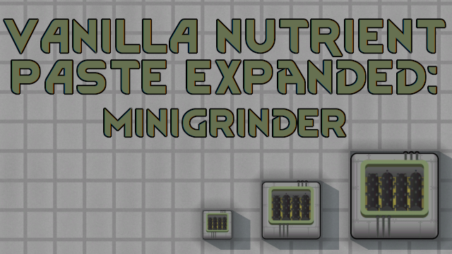

# Vanilla Nutrient Paste Expanded: MiniGrinder

It's minigrinder (2x2) and microgrinder (1x1) now.
  
Smaller grinders are a bit less effective than the big one.

XML-only.

## You may also like...

https://github.com/zed-0xff/RW-MiniGrinder

## Support me

 or [Patreon](https://www.patreon.com/zed_0xff)
