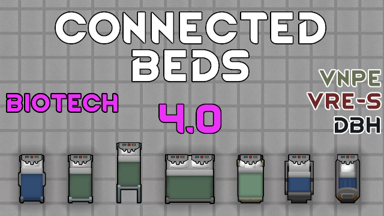

# Connected Bed

## New! Bed Connector

You can build it over ANY other bed and get all the features of Connected Bed!
Extra cool feature: Gene Extractors, Core scanners, and any other enterable buildings are also supported!

So now your pawns won't starve or pee their pants while you pull their brains and genes out!

## Connected Bed

A new hospital bed with 4 cool features:

1. Integrated nutrient paste dripper (requires [VNPE](https://steamcommunity.com/sharedfiles/filedetails/?id=2920385763))
2. Automatic blood draining from prisoners (requires [VRE-S](https://steamcommunity.com/sharedfiles/filedetails/?id=2963116383))
3. Automatic blood transfusion for everyone (requires [VRE-S](https://steamcommunity.com/sharedfiles/filedetails/?id=2963116383))
4. Optional connection to [DBH](https://steamcommunity.com/sharedfiles/filedetails/?id=836308268) for water and bladder needs

You can use it with both [Vanilla Races Expanded - Sanguophage](https://steamcommunity.com/sharedfiles/filedetails/?id=2920385763) and [Vanilla Nutrient Paste Expanded](https://steamcommunity.com/sharedfiles/filedetails/?id=2963116383) simultaneously or with just one of them.

- fully mimics vanilla Hospital Bed
- requires research of Hospital Beds and Nutrient Paste (both vanilla)
- stuffable
- costs 110 metallic + 6 components
- requires construction skill 10 to build
- consumes 25 power (VNPE external dripper needs 50)
- safe to add/remove mid-game
- configurable thresholds in mod's config

Still no custom textures here (I've got trotter hands), just slightly greenish handles, like most VNPE things.

## You may also like...

https://github.com/zed-0xff/RW-ConnectedBed

## Support me

 or [Patreon](https://www.patreon.com/zed_0xff)
