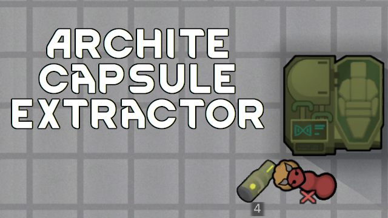

# Archite Capsule Extractor

Extract archite capsules (not genes!) from pawns, obviously killing them in the process.
But pawns must have at least one archite gene to be applicable.
Requires corresponding research.

One capsule always guaranteed, each next one has 75% chance of extraction.
I.e. 10-th capsule will have ~7% chance.

## Verified compatible/supported mods

- [Lifter Plz Do More Jobs](https://steamcommunity.com/sharedfiles/filedetails/?id=2884057958): Mechs should carry pawns to Archite Capsule Extracter too.
- [Gene Extractor Weights](https://steamcommunity.com/sharedfiles/filedetails/?id=2883796262): Mods just don't interfere with each other.
- [Auto-Extract Genes](https://steamcommunity.com/sharedfiles/filedetails/?id=2882834449): Capsules will NOT be auto-extracted.

## You may also like...

https://github.com/zed-0xff/RW-ArchiteCapsuleExtractor

## Support me

 or [Patreon](https://www.patreon.com/zed_0xff)
