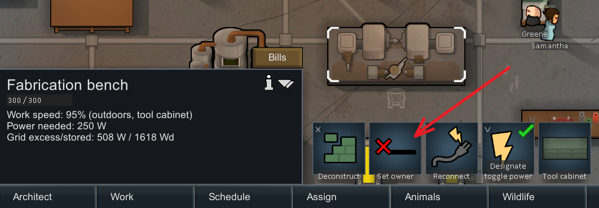

# AssignedWorkbenches

This is a mod for the game RimWorld by Ludeon Studios.

The mod adds the 'Set Owner' Gizmo (like from a Bed) onto all Workbenches.

# Table of Contents

* [Introduction](#introduction)
* [Links](#links)
* [Explanation](#explanation)

# Introduction

The mod adds the 'Set Owner' Gizmo (like from a Bed) onto all Workbenches.

Pawns can be explicitly assigned to the workbench. Multiple pawns can be assigned to the same bench.

If no pawns are assigned (default), then anybody can work the bench (default).

But if any pawns are assigned, then only those assigned pawns can work the bench.

This works independently from the bill restrictions, so make sure bills are not assigned to someone else.

# Links

We're on Steam: https://steamcommunity.com/sharedfiles/filedetails/?id=2973942644

We're on GitHub: https://github.com/maarxx/AssignedWorkbenches

For reporting bugs or requesting features, Github Issues are better than Steam Workshop Comments.

# Explanation

The mod currently targets all of the following:

For benches:
* Anything inheriting from \<ThingDef ParentName="BenchBase">:
  * \<defName>SubcoreEncoder\</defName>
  * \<defName>TableSculpting\</defName>
  * \<defName>TableButcher\</defName>
  * \<defName>HandTailoringBench\</defName>
  * \<defName>ElectricTailoringBench\</defName>
  * \<defName>FueledSmithy\</defName>
  * \<defName>ElectricSmithy\</defName>
  * \<defName>TableMachining\</defName>
  * \<defName>ElectricStove\</defName>
  * \<defName>FueledStove\</defName>
  * \<defName>TableStonecutter\</defName>
  * \<defName>Brewery\</defName>
  * \<defName>DrugLab\</defName>
  * \<defName>ElectricSmelter\</defName>
  * \<defName>BiofuelRefinery\</defName>
  * \<defName>FabricationBench\</defName>
  * \<defName>SimpleResearchBench\</defName>
  * \<defName>HiTechResearchBench\</defName>
* Manually patched:
  * defName="GeneAssembler"
  * defName="LongRangeMineralScanner"
  * defName="GroundPenetratingScanner"
  * defName="CraftingSpot"
  * defName="ButcherSpot"

For WorkGivers:
* Anything inheriting from WorkGiver_DoBill
* Manually patched:
  * WorkGiver_CreateXenogerm
  * WorkGiver_OperateScanner
  * WorkGiver_Researcher
