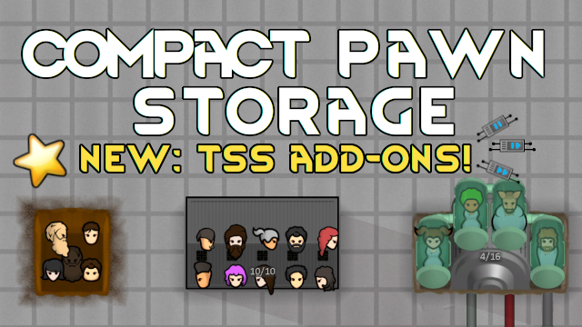

# CPS: Compact Pawn Storage

## The Pit
Just a deep hole in the ground. Only for prisoners.

- Requires no research nor resources.
- Very easy to build. Very dirty. Very uncomfortable.
- Very high chance of infections and tantrums.
- Can be built outside. Prisoners will not be able to escape unless they have some superjump or teleport abilities.
- Fits 5 prisoners in 2x2 space

## Cabin
High density housing with integrated temperature controls.

- Some research and resources required.
- Soundproof
- Has climate controls
- Has some comfort
- Movable
- Pawns can eat inside
- Can be assigned to prisoners, but needs extra outside walls or high fences to contain them.
- Fits 10 pawns in 4x2 space

## TSS (Test Subject Storage)
Pawns are stored in the individual capsules, in a conveyor-like rotating facility.
Their basic needs are satisfied, but don't expect them to be happy while inside the TSS.
The space is tight and forced sleep causes nightmares.
Warranty void if kept without power for more than 2 hours.

- Requires lots of research and resources
- Does not act like a bed
- Built-in nutrient paste producer
- Optionally connects to [VNPE](https://steamcommunity.com/sharedfiles/filedetails/?id=2920385763) network
- Optionally connects to [VRE-S](https://steamcommunity.com/sharedfiles/filedetails/?id=2963116383) hemogen network
- Optionally connects to [DBH](https://steamcommunity.com/sharedfiles/filedetails/?id=836308268) for all hygienic needs
- Maintains comfortable inside temperature
- Configurable auto-capture and auto-eject settings, can automate gene extract process
- Gene Extractor now has button to process pawns contained in TSS
- Can be enhanced with time dilation/acceleration/freeze researchable add-ons
- All genetic effects like pregnancy, egg/gene/jelly/whatever spawners should keep working for TSS occupants
- Fits 16 pawns in 4x2 space

### Verified compatible/supported mods

- [Alpha Genes](https://steamcommunity.com/sharedfiles/filedetails/?id=2891845502)
- [Dubs Bad Hygiene](https://steamcommunity.com/sharedfiles/filedetails/?id=836308268)
- [Fences And No Floors](https://steamcommunity.com/sharedfiles/filedetails/?id=1567724907)
- [Lifter Plz Do More Jobs](https://steamcommunity.com/sharedfiles/filedetails/?id=2884057958)
- [Prisoner Utils](https://steamcommunity.com/sharedfiles/filedetails/?id=2864410456)
- [Vanilla Factions Expanded - Insectoids](https://steamcommunity.com/sharedfiles/filedetails/?id=2149755445)
- [Vanilla Furniture Expanded](https://steamcommunity.com/sharedfiles/filedetails/?id=1845154007)
- [Vanilla Nutrient Paste Expanded](https://steamcommunity.com/sharedfiles/filedetails/?id=2920385763)
- [Vanilla Races Expanded - Sanguophage](https://steamcommunity.com/sharedfiles/filedetails/?id=2963116383)
- [WVC - Xenotypes and Genes](https://steamcommunity.com/sharedfiles/filedetails/?id=2886992038)
- [Vanilla Races Expanded - Android](https://steamcommunity.com/sharedfiles/filedetails/?id=2975771801)
- [More Slavery Stuff](https://steamcommunity.com/sharedfiles/filedetails/?id=2896845138)

### You may also like...

https://github.com/zed-0xff/RW-CPS

## Support me

 or [Patreon](https://www.patreon.com/zed_0xff)
