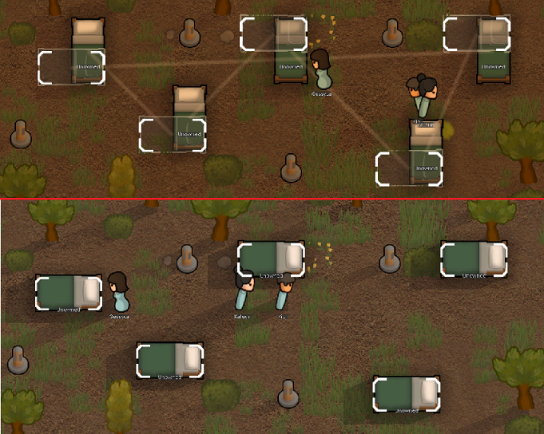

# BlueprintOverMinifiable

This is a mod for the game RimWorld by Ludeon Studios.

The mod allows you to place blueprints to construct/install over top of uninstallable things.

Pawns will then automatically uninstall that thing to make room for the blueprint.

# Table of Contents

* [Introduction](#introduction)
* [Links](#links)
* [Explanation](#explanation)

# Introduction

The mod allows you to place blueprints to construct/install over top of uninstallable things.

Pawns will then automatically uninstall that thing to make room for the blueprint.

# Links

We're on Steam: https://steamcommunity.com/sharedfiles/filedetails/?id=2974710896

We're on GitHub: https://github.com/maarxx/BlueprintOverMinifiable

For reporting bugs or requesting features, Github Issues are better than Steam Workshop Comments.

# Explanation

