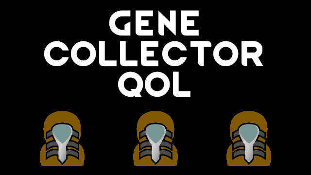

# Gene Collector QoL

## Gene Assembler

- Xenogerm queue - you now can specify the quantity of xenogerms you want to make
- Show available archite capsules count

- Highlight genes in a combined genepack that we don't have as separate genes

## Xenogerm

- Colored gene listing in inspect string
- "Implant into a prisoner" button
- Suppress normal "Xenogerm implantation ordered" letter

## Gene Extractor

- Colorize "Gene extraction complete" message

## Mod patches

- [Random's Gene Assistant](https://steamcommunity.com/sharedfiles/filedetails/?id=2882497271): support coloring of all genepacks
- [Alpha Genes](https://steamcommunity.com/sharedfiles/filedetails/?id=2891845502): suppress "Unstable mutation gained" message
- [WVC - Xenotypes and Genes](https://steamcommunity.com/sharedfiles/filedetails/?id=2886992038): notify about spawned genepacks

## Misc

- added "DEV: Add specific gene..." dev.mode gizmo for gene banks

## You may also like...

https://github.com/zed-0xff/RW-GeneCollectorQOL

## Support me

 or [Patreon](https://www.patreon.com/zed_0xff)
