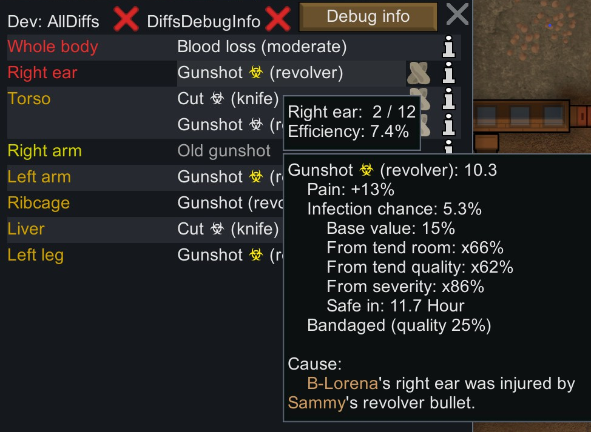
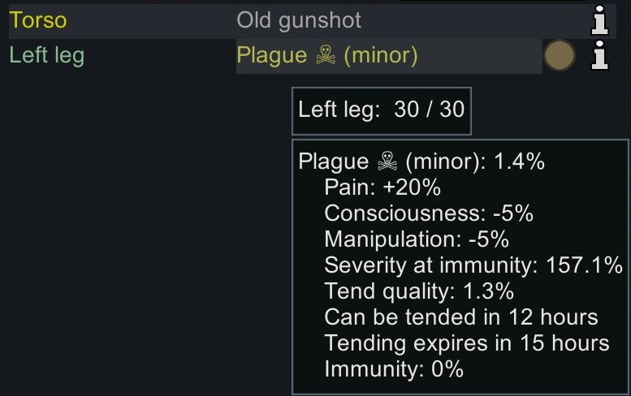

# Infection Info for RimWorld

Ever wondering why those nasty infections occur so often? This is a QoL mod that attempts to demystify the infection mechanism behind the scenes. It displays the real time infection chance and uncovers the influential factors. It provides an option to make the infection chance rely on the current room cleanliness instead of that at the time of tending (Default off). It highlights when the immunity gain is so slow that a pawn might die.

## Base Game Mechanism For Infection

- Some injuries might develop infections.
- Once a susceptible injury occurs, the game does a first pass RNG check using the base infection chance.
- If success, a random number is picked to determine how soon the wound will be infected.
    - This number ranges between 6 hours to 18 hours, referred as danger period.
- At the scheduled time, a second RNG check is done to determine whether the infection is applied eventually.
    - The chance here is based on a few factors e.g. tend quality, tend room cleanliness, injury severity.

## What Does This Mod Do

- It shows the infection chance breakdown in the injury tooltip.
- It shows how soon the injury would enter or leave the danger period.
- Injuries that are susceptible to infection are marked with a special color icon.
    - White for grace period
    - Yellow for danger period with a low infection risk
    - Red for danger period with a high infection risk
- It provides an option to make the infection chance rely on the current room cleanliness instead of that at the time of tending. (Default off)
    - This makes field tending viable as the patients benefit from resting in a clean room after battle.
    - No longer have to remember to clean the room just before tending.

## Additional Features

- Under unfortunate circumstances a pawn gets infected. It becomes a race against time in order to survive. This mod predicts Hediff severity when a pawn reaches full immunity, and marks the ones that could kill a pawn due to immunity gain not being fast enough. Work on other Hediffs e.g. flu as well.

## What Does This Mod NOT Do

- The default mode does not alter game mechanism.
- It does not modify saves. Safe to add or remove at any time.
- It does not reveal when exactly the infection would happen. (Visible in Dev mod already)
- It does not reveal ahead of time that an injury will not develop an infection if the first RNG check doesn't pass.

